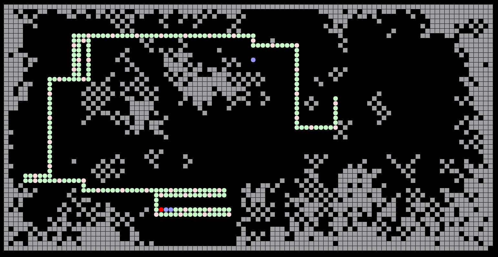

QSnake
======

a very simple game written in Qt5 based on these rules:

* Snake grows every 10 steps by one unit
* every step a brick is spawn
* bricks tend to colonize
* every 100 steps a bomb appears
* bombs can be collected and used with the spacebar
* bombs have a radius of 10 units



# Demo Video
[](https://www.youtube.com/watch?v=6lUHXIsVJDg "QSnake Gameplay Demo")


# Controls
* arrow keys
* spacebar (resets game and triggers bombs)
* P for pausing the game

# Requirements
Nothing special, a default PC should do it. In the code is still some potential for 
speed improvements. Please notify me, if the game is too laggy on your system. 

# Configuration
Currently all parameters can be configured in the file `QSnake.conf` only, which is by default in 
`~/.config/KarlZeilhofer/` on Linux or `%APPDATA%\KarlZeilhofer` on Windows. 

A typical config could be:
```
[General]
BombInterval=100
BombRadius=10
BoxSize=8
BrickAttraction=15
BrickSize=8
GrowInterval=10
HeadClearance=7
InitialLength=10
SizeX=100
SizeY=60
delayEasy=250
delayExtreme=50
delayHard=100
delayMedium=150
difficulty=1
highScore=143
```

Delays are in milli seconds.  
Dimensions are in multiple of `BoxSize` and `BoxSize` itself is in pixels.  
`difficulty` could be 0 to 3 for easy to extreme.  
`BrickAttraction` is the inverse of the probability for a brick middle 
in nowhere without any neighbors. 


# Building on Linux

```
qmake
make
```

# License
public domain


